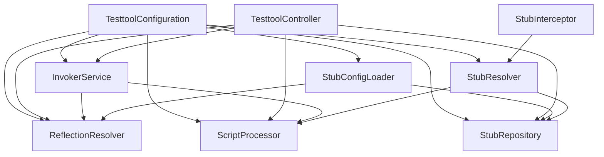
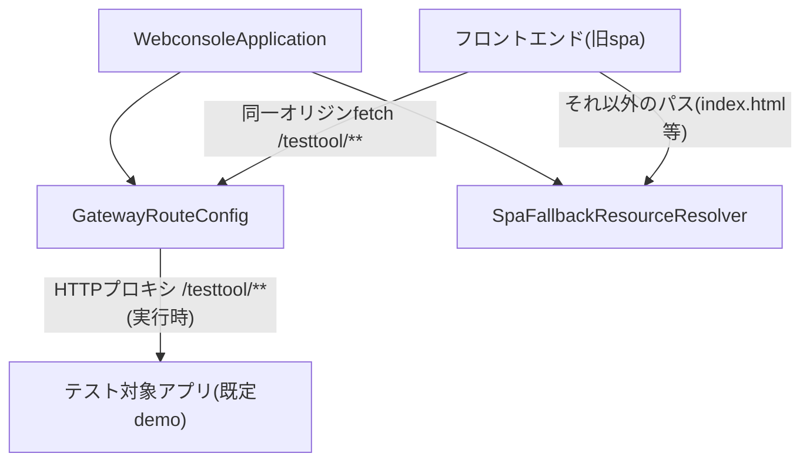
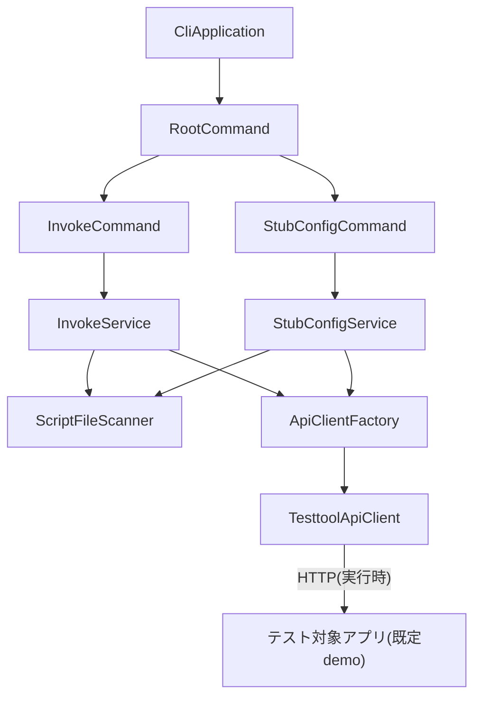
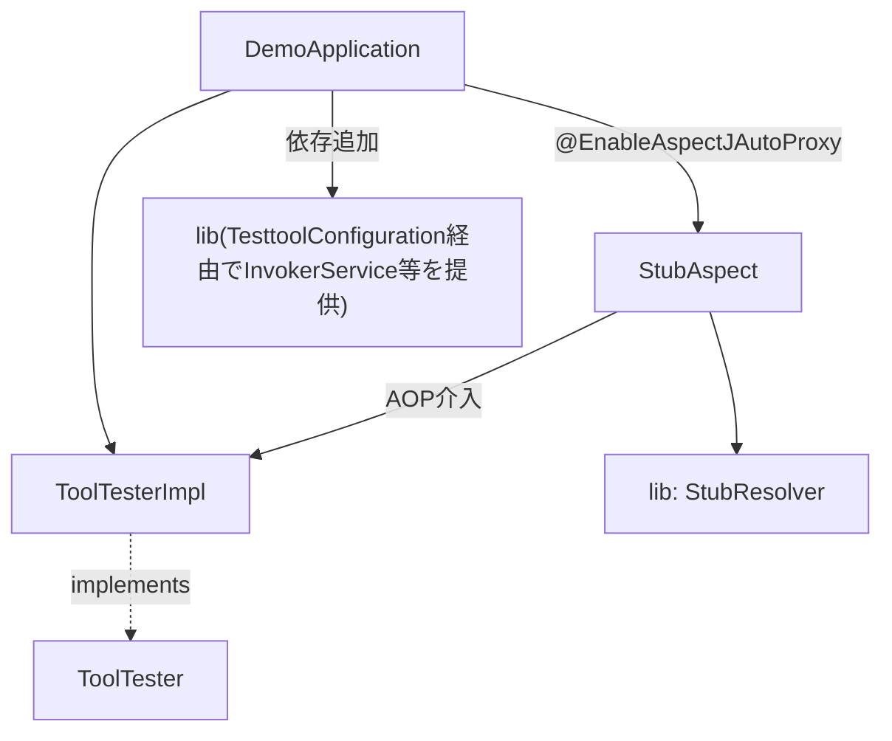
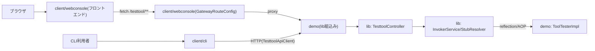

# Component Dependency

## モジュール間依存マトリクス

| モジュール | ビルド時依存 | 実行時依存 |
|---|---|---|
| lib | なし | なし(単体で動作しない、組み込まれる側) |
| demo | lib(コンパイル依存) | なし |
| client/webconsole | なし | demo(または任意のテスト対象アプリ)へのHTTPプロキシ先 |
| client/cli | なし | demo(または任意のテスト対象アプリ)へのHTTP呼出し先 |

`client/webconsole`・`client/cli`は`lib`・`demo`に対してビルド時の依存を一切持たない(HTTP通信のみで疎結合)。これはRequirements Analysis時点の既存構成(gateway/spa/cli)と同じ設計思想を維持している。

## モジュール内コンポーネント依存(lib)



## モジュール内コンポーネント依存(client/webconsole)



## モジュール内コンポーネント依存(client/cli)



## モジュール内コンポーネント依存(demo)



## データフロー(全体像)



### テキスト代替
```
[ブラウザ] -> [webconsoleフロントエンド] -> [webconsole GatewayRouteConfig] -(proxy)-> [demo(lib組込み)]
[CLI利用者] -> [client/cli] -(HTTP)-> [demo(lib組込み)]
[demo] 内部: TesttoolController -> InvokerService/StubResolver -> ToolTesterImpl(reflection/AOP)
```

## 通信パターンまとめ

| 通信 | プロトコル | 認証 | 備考 |
|---|---|---|---|
| ブラウザ ⇔ webconsoleフロントエンド | HTTP(同一オリジン) | なし | 静的リソース配信・CORS不要 |
| webconsoleフロントエンド ⇔ GatewayRouteConfig | HTTP fetch(同一オリジン) | なし | `/testtool/**`のみ。開発時はVite dev server proxyで同一オリジン化(CORS不要) |
| GatewayRouteConfig ⇔ テスト対象アプリ | HTTPプロキシ(`/testtool/**`のみ) | なし(既定) | `backend.uri`相当の設定で切替可能 |
| client/cli ⇔ テスト対象アプリ | HTTP(`TesttoolApiClient`) | BASIC認証・追加ヘッダ(CLIオプションで指定) | webconsoleを経由しない直接呼出し |
