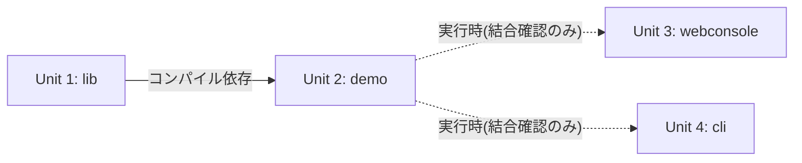

# Unit of Work Dependency

## 依存関係マトリクス

| Unit | ビルド時依存 | 実行時依存(結合確認) | 着手順序 |
|---|---|---|---|
| Unit 1: lib | なし | なし | 1番目(最初) |
| Unit 2: demo | Unit 1(lib、コンパイル依存) | なし | 2番目(Unit 1完了後) |
| Unit 3: webconsole | なし | Unit 2(demo、プロキシ先として起動が必要) | 3番目 |
| Unit 4: cli | なし | Unit 2(demo、呼出し先として起動が必要) | 4番目(最後) |

## 依存関係図



### テキスト代替
```
Unit 1(lib) --コンパイル依存--> Unit 2(demo)
Unit 2(demo) -.実行時(結合確認のみ).-> Unit 3(webconsole)
Unit 2(demo) -.実行時(結合確認のみ).-> Unit 4(cli)
```

## 着手順序の根拠

- **Unit 1(lib)が最初**: Unit 2(demo)がコンパイル時に依存するため、必ず先に完了させる必要がある
- **Unit 2(demo)が2番目**: Unit 1完了後、`lib`の具象クラス・`TesttoolController`を組み込んだデモアプリを構築する。Unit 3・Unit 4の結合確認(手動)の対象アプリとなる
- **Unit 3(webconsole)が3番目、Unit 4(cli)が4番目**: 両者はビルド時に相互依存・lib/demoへの依存を持たないため、順序自体に技術的な制約は無い。Unit of Work PlanのQuestion 2でユーザーが「ブラウザで確認できるwebconsoleを先に完成させる」方針を選択したため、この順序とする

## Unit間の通信(参考、Application Design component-dependency.mdより)

- Unit 3(webconsole)⇔Unit 2(demo): HTTPプロキシ(`/testtool/**`のみ)
- Unit 4(cli)⇔Unit 2(demo): HTTP(`TesttoolApiClient`経由、webconsoleを介さない直接呼出し)
