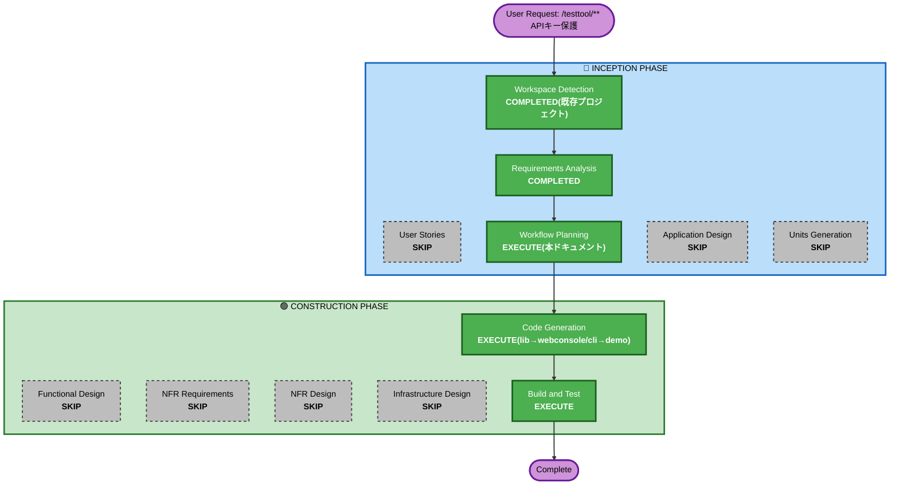

# Execution Plan: `/testtool/**` APIキー保護

## Detailed Analysis Summary

### Transformation Scope (Brownfield Only)
- **Transformation Type**: Multi-component change(既存4Unit中3Unit + demoの計4箇所に影響。新規Unit分解は不要)
- **Primary Changes**:
  - `lib`: `TesttoolAutoConfiguration`へ`ApiKeyFilter`(新規`jakarta.servlet.Filter`実装)を追加し`/testtool/**`のヘッダ検証を行う
  - `client/webconsole`: `GatewayRouteConfig`のプロキシ時に、設定されていればAPIキーヘッダを自動付与
  - `client/cli`: `RootCommand`/`RequestHeaderBuilder`で、設定されていれば既定ヘッダとしてAPIキーを付与(`--header`個別指定は継続可)
  - `demo`: `application.yml`に動作確認用の設定例(既定は無効)を追加
- **Related Components**: `TesttoolController`(`/testtool/**`の実処理、Filterはその手前で動作するため実装変更なし)

### Change Impact Assessment
- **User-facing changes**: No(内部的なアクセス制御の追加のみ。既定(未設定)では現状の挙動を維持)
- **Structural changes**: No(新規クラス`ApiKeyFilter`1つの追加のみ、既存クラス構造は変更しない)
- **Data model changes**: No
- **API changes**: No(URLパス・パラメータの変更なし。未認証時のみ401応答が新たに発生しうる)
- **NFR impact**: Yes(アクセス制御という観点でのセキュリティ強化。ただしSecurity Baseline拡張の適用要否には影響しない、既存の不採用判断(NFR3)を維持したまま軽量な自前実装で対応するため)

### Component Relationships (Brownfield Only)
- **Primary Components**: `lib`の`TesttoolAutoConfiguration`(新規`ApiKeyFilter`Bean登録)、`client/webconsole`の`GatewayRouteConfig`、`client/cli`の`RootCommand`・`RequestHeaderBuilder`
- **Dependent Components**: `demo`(設定例追加のみ、コード変更なし)
- **Supporting Components**: なし(追加依存ゼロ、既存のSpring Boot/Servlet API・Spring Cloud Gateway Server MVC・Picocliの範囲内で完結)

### Risk Assessment
- **Risk Level**: Low-Medium(各コンポーネントの変更自体は小規模・独立だが、4箇所にまたがりセキュリティ関連ロジックのため正確性の検証が重要)
- **Rollback Complexity**: Easy(各コンポーネントの追加コードを削除するのみ。既定(未設定)では無効なため、設定しなければ影響ゼロ)
- **Testing Complexity**: Moderate(4コンポーネントを横断した結合確認が必要。キー未設定/設定済み/一致/不一致の組合せ確認)

## Workflow Visualization



### Text Alternative
```
INCEPTION
- Workspace Detection: COMPLETED(既存プロジェクトを再利用)
- Requirements Analysis: COMPLETED(FR10.1-10.6)
- User Stories: SKIP(内部的なアクセス制御強化のみ、ユーザー向け機能変更なし)
- Workflow Planning: EXECUTE(本ドキュメント)
- Application Design: SKIP(コンポーネント間の契約(ヘッダ名・プロパティ名・登録方式)はRequirements Analysisで既に確定済み)
- Units Generation: SKIP(新規Unit不要、既存4Unit(lib/webconsole/cli/demo)内の協調した変更)

CONSTRUCTION
- Functional Design: SKIP(新規業務ロジック・ドメインモデルなし、FR10で仕様確定済み)
- NFR Requirements/NFR Design: SKIP(技術選定は追加依存ゼロで既に確定、Security Baseline拡張の不採用判断(NFR3)は維持)
- Infrastructure Design: SKIP(インフラ変更無し)
- Code Generation: EXECUTE(lib→webconsole/cli→demoの順で1つの計画にまとめて実施)
- Build and Test: EXECUTE(4コンポーネント横断の回帰確認・キー有無/一致不一致の結合確認)
```

## Module Update Strategy

- **Update Approach**: Sequential(依存順)。`lib`(検証ロジック本体)を先に実装・確認した上で、`webconsole`・`cli`(いずれもリクエスト送信側で`lib`に依存しない独立した変更のため並行可能)、最後に`demo`(設定例、コード変更なし)
- **Critical Path**: `lib`のFilter実装(ヘッダ名・プロパティ名の実際の契約点)
- **Coordination Points**: プロパティ名(`cherry.testtool.web.api-key`/`cherry.testtool.web.api-key-header`)とヘッダ名の既定値(`X-Cherry-Testtool-Api-Key`)を全コンポーネントで一致させること
- **Testing Checkpoints**: `lib`単体でのFilter動作確認後、`demo`+`webconsole`+`cli`を実際に起動しHTTP経由で結合確認(キー未設定/設定済み一致/設定済み不一致の3パターン)

## Phases to Execute

### 🔵 INCEPTION PHASE
- [x] Workspace Detection (COMPLETED — 既存プロジェクト継続)
- [x] Requirements Analysis (COMPLETED — requirements.md FR10.1-10.6)
- [x] User Stories (SKIPPED)
  - **Rationale**: 内部的なアクセス制御の強化のみで、ユーザー向け機能・画面・APIパスの変更を伴わないため
- [x] Execution Plan (本ドキュメント、IN PROGRESS)
- [ ] Application Design - SKIP
  - **Rationale**: コンポーネント間の契約(ヘッダ名・プロパティ名・Filter登録方式)はRequirements Analysisでの対話・確認質問により既に確定済みで、追加の設計判断が残っていないため
- [ ] Units Generation - SKIP
  - **Rationale**: 新規Unitは不要。既存4Unit(lib/webconsole/cli/demo)内での協調した変更であり、依存順序はModule Update Strategyで代替可能なため

### 🟢 CONSTRUCTION PHASE
- [ ] Functional Design - SKIP
  - **Rationale**: 新規業務ロジック・ドメインモデルを伴わないため(FR10.1-10.6で仕様は確定済み)
- [ ] NFR Requirements - SKIP
  - **Rationale**: 技術選定(追加依存ゼロの自前Filter)は既に確定済み。Security Baseline拡張は引き続き不採用(NFR3)のため新規NFR要件は無い
- [ ] NFR Design - SKIP
  - **Rationale**: NFR Requirementsをスキップしたため
- [ ] Infrastructure Design - SKIP
  - **Rationale**: インフラ・デプロイ構成の変更を伴わないため
- [ ] Code Generation - EXECUTE (ALWAYS)
  - **Rationale**: FR10.1-10.6の実装(lib/webconsole/cli/demoへの変更)が必要。4コンポーネントをまたぐが、単一の統合計画として実施する(各変更が小規模かつ密結合な1機能のため)
- [ ] Build and Test - EXECUTE (ALWAYS)
  - **Rationale**: 4コンポーネント横断の回帰確認、およびキー未設定/設定済み一致/設定済み不一致の組合せ結合確認が必要

### 🟡 OPERATIONS PHASE
- [ ] Operations - PLACEHOLDER

## Estimated Timeline
- **Total Stages**: 2実行(Code Generation、Build and Test) + 7スキップ
- **Estimated Duration**: 数十分程度(4コンポーネントへの小規模な変更 + 結合確認)

## Success Criteria
- **Primary Goal**: `cherry.testtool.web.api-key`が設定されている場合、`/testtool/**`への未認証アクセスが401で拒否される。未設定の場合は現状通り動作する
- **Key Deliverables**: `ApiKeyFilter`(lib)、`GatewayRouteConfig`の自動ヘッダ付与(webconsole)、`RootCommand`/`RequestHeaderBuilder`の既定ヘッダ付与(cli)、`demo/application.yml`の設定例
- **Quality Gates**: `./gradlew build`(リポジトリ全体)成功、既存テスト回帰無し、demo+webconsole+cliを実際に起動しキー未設定/一致/不一致の3パターンで想定通りの応答(現状動作/200/401)を確認
