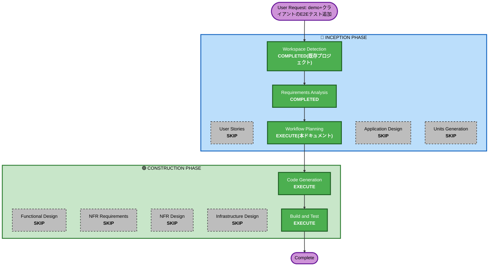

# Execution Plan: demo+クライアント(cli/webconsole)のE2Eテスト追加

## Detailed Analysis Summary

### Transformation Scope (Brownfield Only)
- **Transformation Type**: 新規テスト基盤の追加(既存4Unit(`lib`/`demo`/`client:cli`/`client:webconsole`)のいずれのアプリケーションコードも変更しない。既存Unit境界外に新規`e2e/`ディレクトリ(Gradleマルチプロジェクト対象外の独立npmプロジェクト)を追加する)
- **Primary Changes**:
  - リポジトリ直下に`e2e/`ディレクトリを新設(`@playwright/test`ベース)
  - `.github/workflows/e2e.yml`を新設(GitHub Actionsによる自動実行)
  - 既存4モジュールのビルド成果物(demo/webconsole/cliの各jar)を利用してPlaywrightからプロセス起動・HTTP/ブラウザ操作・cli子プロセス実行を行う
- **Related Components**: `demo`(単体起動対象)、`client/webconsole`(単体起動+実ブラウザ操作対象)、`client/cli`(ビルド+子プロセス実行対象)。`lib`は直接の変更対象ではない(demo/webconsole/cli経由で間接的に検証される)

### Change Impact Assessment
- **User-facing changes**: No(開発者向けテスト基盤の追加であり、アプリケーションの挙動・画面・APIには変更を加えない)
- **Structural changes**: Yes(リポジトリ直下に`e2e/`・`.github/workflows/`という、既存のGradleマルチプロジェクト構成の外側に新規ディレクトリを追加する)
- **Data model changes**: No
- **API changes**: No(既存の`/testtool/**` API・cliコマンド体系を変更せず、それらを外部から呼び出して検証するのみ)
- **NFR impact**: Yes(NFR2「テスト」方針の拡張。手動確認手順に加えPlaywrightによる自動E2Eを整備する)

### Component Relationships (Brownfield Only)
- **Primary Component**: 新規`e2e/`(既存Unitには属さない、リポジトリ直下の独立npmプロジェクト)
- **Infrastructure Components**: `.github/workflows/e2e.yml`(新規、リポジトリ初のCIワークフロー)
- **Shared Components**: なし(既存4モジュールのソースコードは変更しない。ビルド成果物(jar)を消費するのみ)
- **Dependent Components**: なし(`e2e/`に依存する他コンポーネントは無い)
- **Supporting Components**: `demo`(E2E実行時にjava -jarで起動)、`client/webconsole`(同、8080/9090の2プロセス)、`client/cli`(E2E実行時に都度`./gradlew :client:cli:bootJar`でビルドし子プロセス実行)

### Risk Assessment
- **Risk Level**: Medium(既存アプリケーションコードへの変更は無くロールバックは容易だが、複数プロセスの自動起動・停止というこのリポジトリ初の仕組みであり、環境依存の不安定さが生じうる)
- **Rollback Complexity**: Easy(`e2e/`・`.github/workflows/e2e.yml`を削除するだけで、既存4モジュールへの影響なく完全に取り除ける)
- **Testing Complexity**: Moderate(demo・webconsoleの2プロセスの自動起動待ち合わせ、cliの都度ビルド、ブラウザ操作の安定化(要素待機等)が必要)

## Workflow Visualization



### Text Alternative
```
INCEPTION
- Workspace Detection: COMPLETED(既存プロジェクトを再利用)
- Requirements Analysis: COMPLETED(requirements.md FR12)
- User Stories: SKIP(単一ユーザー種別(開発者)のローカル開発ツールという既存方針を継続。テスト基盤追加であり新規ユーザーシナリオ・複数ペルソナは発生しない)
- Workflow Planning: EXECUTE(本ドキュメント)
- Application Design: SKIP(新規の業務コンポーネント・サービス層は発生しない。E2Eテストは既存API/CLIインタフェースを外部から消費するのみで、シナリオ・実装方針はRequirements Analysis(FR12)で既に確定済み)
- Units Generation: SKIP(新規業務Unitは不要。単一のテスト基盤追加として1回のCode Generationで完結する)

CONSTRUCTION
- Functional Design: SKIP(新規業務ロジック・ドメインモデルなし。既存機能の検証コードのみ)
- NFR Requirements/NFR Design: SKIP(技術スタック(Playwright/@playwright/test、GitHub Actions)はRequirements Analysisで確定済み。新規の性能・セキュリティ要件は無い)
- Infrastructure Design: SKIP(クラウドインフラ・IaCの変更を伴わない。GitHub Actionsワークフローはシンプルな構成でCode Generationの一部として扱う)
- Code Generation: EXECUTE(e2e/ディレクトリ新設、Playwright設定、テストシナリオ実装、GitHub Actionsワークフロー作成)
- Build and Test: EXECUTE(E2Eテスト自体をローカルで実行し成功を確認する。既存4モジュールの`./gradlew build`が引き続き成功することも確認する)
```

## Phases to Execute

### 🔵 INCEPTION PHASE
- [x] Workspace Detection (COMPLETED — 既存プロジェクト継続)
- [x] Requirements Analysis (COMPLETED — requirements.md FR12)
- [x] User Stories (SKIPPED)
  - **Rationale**: 単一ユーザー種別(開発者)のローカル開発ツールという既存プロジェクト全体の方針を継続。テスト基盤の追加であり、新規の業務シナリオ・複数ペルソナ・受入基準の整理を要する変更ではないため
- [x] Execution Plan (本ドキュメント、IN PROGRESS)
- [ ] Application Design - SKIP
  - **Rationale**: 新規の業務コンポーネント・サービス層は発生しない。E2Eテストは既存のREST API(`/testtool/**`)・cliコマンド体系という確立済みインタフェースを外部から呼び出すのみであり、テストシナリオ・実装方針はRequirements Analysis(FR12)で既に具体的に確定している
- [ ] Units Generation - SKIP
  - **Rationale**: 新規の業務Unitは不要。既存4Unit(lib/demo/client:cli/client:webconsole)のいずれのコードも変更せず、`e2e/`という単一のテスト基盤追加として1回のCode Generationで完結するため

### 🟢 CONSTRUCTION PHASE
- [ ] Functional Design - SKIP
  - **Rationale**: 新規業務ロジック・ドメインモデルを伴わない。既存機能(invoke/stubconfig)の検証コードが中心
- [ ] NFR Requirements - SKIP
  - **Rationale**: 技術スタック(Playwright/`@playwright/test`、Node.js、GitHub Actions)はRequirements Analysis(FR12確認質問)で既に確定済み。新規のパフォーマンス・セキュリティ・スケーラビリティ要件は発生しない
- [ ] NFR Design - SKIP
  - **Rationale**: NFR Requirementsをスキップしたため
- [ ] Infrastructure Design - SKIP
  - **Rationale**: クラウドインフラ・IaCの変更を伴わない。GitHub Actionsワークフロー(`.github/workflows/e2e.yml`)はシンプルな構成であり、Code Generationの一部として扱う
- [ ] Code Generation - EXECUTE (ALWAYS)
  - **Rationale**: `e2e/`ディレクトリ新設(`package.json`・`playwright.config.ts`・`globalSetup`/`globalTeardown`)、テストシナリオ実装(cli直接・webconsole実ブラウザ・スタブ効果・APIキー設定時)、`.github/workflows/e2e.yml`の作成が必要
- [ ] Build and Test - EXECUTE (ALWAYS)
  - **Rationale**: `npm run test:e2e`(`e2e/`配下)の成功確認に加え、`./gradlew build`(既存4モジュール、E2E追加による影響が無いことの確認)、GitHub Actionsワークフローの妥当性確認(可能な範囲で)が必要

### 🟡 OPERATIONS PHASE
- [ ] Operations - PLACEHOLDER

## Estimated Timeline
- **Total Stages**: 2実行(Code Generation、Build and Test) + 7スキップ
- **Estimated Duration**: 数時間程度(新規ツール(Playwright)導入・複数プロセスのオーケストレーション・GitHub Actions初導入のため、FR11等より試行錯誤が生じやすい)

## Success Criteria
- **Primary Goal**: `e2e/`配下のPlaywrightテストが、demo・webconsoleを自動起動した状態で、cli直接・webconsole実ブラウザ操作の両経路から`invoke`・`stubconfig register/show/clear`(スタブ効果反映込み)を検証し、APIキー設定時・未設定時の双方で成功する
- **Key Deliverables**:
  - `e2e/package.json`・`e2e/playwright.config.ts`(`@playwright/test`依存、`globalSetup`/`globalTeardown`)
  - `e2e/tests/`配下のテストシナリオ(cli・webconsole・スタブ効果・APIキー)
  - `.github/workflows/e2e.yml`(push/PR時の自動実行、`workflow_dispatch`による手動実行)
  - 既存`cli`/`webconsole` README「手動結合確認手順」は残置(変更なし)
- **Quality Gates**: `e2e/`での`npm run test:e2e`成功、`./gradlew build`(全モジュール)成功、GitHub ActionsワークフローのYAML妥当性確認(可能であればローカルでの`act`等によるドライラン、または実際のpushでの動作確認)
