# Execution Plan

## Detailed Analysis Summary

### Transformation Scope (Brownfield)
- **Transformation Type**: Architectural transformation(モジュール構成の再編を伴う)
- **Primary Changes**:
  - `client/gateway`(WebFlux版Spring Cloud Gateway)と`client/spa`(React SPA)を、新規モジュール`client/webconsole`(Spring MVC + Spring Cloud Gateway Servlet版、SPA静的配信を統合)へ再編
  - `lib`内のInterface/Impl分離(5組)を解消し具象クラス構成へ簡素化
  - `client/cli`をシェルスクリプトからSpring Bootアプリ(Picocli)へ全面書き換え
  - `lib`を組み込むデモアプリ(`cherry-testtool-demo`)を新設
  - コード全体でのコメント充実(FR7)とJSpecifyベースのNullability規約統一(NFR5)
- **Related Components**: `lib`, `client/gateway`(廃止), `client/spa`(廃止), `client/webconsole`(新設), `client/cli`(全面書換え), デモアプリ(新設)

### Change Impact Assessment
- **User-facing changes**: Yes — `client/webconsole`の待受ポート変更(8070→9090)、CLIの操作方法が全面的にシェルスクリプトからJavaコマンドへ変更
- **Structural changes**: Yes — モジュール構成そのものを再編(4モジュール→lib+webconsole+cli+demoの4モジュール、うち2モジュールが新設)
- **Data model changes**: No — 永続データモデルなし(StubRepositoryはインメモリのまま)
- **API changes**: Partial — `lib`の内部Java API(Interface削除)は破壊的変更。REST APIの外部契約(パス・パラメータ)自体はFR1-FR7の範囲では変更を明記していないが、NFR1により必要な場合は変更を許容
- **NFR impact**: Yes — NFR5(Nullability規約統一)、NFR2(テスト方針)

### Component Relationships
- **Primary Components**: `lib`(コアライブラリ、Interface/Impl統合対象)
- **New Components**: `client/webconsole`(gateway+spa統合)、`client/cli`(Picocli CLI)、デモアプリ(`cherry-testtool-demo`)
- **Shared Components**: なし(各モジュールはビルド時に独立。`demo`のみ`lib`へのコンパイル依存を持つ)
- **Dependent Components**: `demo`は`lib`に依存(コンパイル時)。`webconsole`・`cli`は`demo`(または任意のテスト対象アプリ)へ実行時のみ依存
- **Supporting Components**: なし(CI/CDパイプライン未検出)

| コンポーネント | 変更種別 | 変更理由 | 優先度 |
|---|---|---|---|
| lib | Major(Interface削除は破壊的変更) | FR3/FR4/FR7/NFR5 | Critical(demoがコンパイル依存するため最優先) |
| demo(新設) | New | FR6/FR7/NFR5 | Important(libに次いで構築、webconsole/cliの動作確認先) |
| client/webconsole(新設、旧gateway+spa) | New(旧2モジュール廃止) | FR1/FR2/FR7/NFR5 | Important |
| client/cli(全面書換え) | Major | FR5/FR7/NFR5 | Important |

### Risk Assessment
- **Risk Level**: High(システム全体に及ぶ再編、`lib`の公開Java APIに破壊的変更、2モジュール新設)
- **Rollback Complexity**: Moderate(Gitでの復元は容易だが、変更範囲が広く部分的ロールバックは複雑)
- **Testing Complexity**: Complex(単体テスト更新に加え、webconsole経由のプロキシ動作・CLIからのAPI呼出しという結合的な動作確認が必要)

## Workflow Visualization

```mermaid
flowchart TD
    Start(["User Request"])

    subgraph INCEPTION["🔵 INCEPTION PHASE"]
        WD["Workspace Detection<br/><b>COMPLETED</b>"]
        RE["Reverse Engineering<br/><b>COMPLETED</b>"]
        RA["Requirements Analysis<br/><b>COMPLETED</b>"]
        US["User Stories<br/><b>SKIPPED</b>"]
        WP["Workflow Planning<br/><b>IN PROGRESS</b>"]
        AD["Application Design<br/><b>EXECUTE</b>"]
        UG["Units Generation<br/><b>EXECUTE</b>"]
    end

    subgraph CONSTRUCTION["🟢 CONSTRUCTION PHASE"]
        FD["Functional Design<br/><b>EXECUTE(Unit毎に判断)</b>"]
        NFRA["NFR Requirements<br/><b>SKIP</b>"]
        NFRD["NFR Design<br/><b>SKIP</b>"]
        ID["Infrastructure Design<br/><b>SKIP</b>"]
        CG["Code Generation<br/><b>EXECUTE</b>"]
        BT["Build and Test<br/><b>EXECUTE</b>"]
    end

    subgraph OPERATIONS["🟡 OPERATIONS PHASE"]
        OPS["Operations<br/><b>PLACEHOLDER</b>"]
    end

    Start --> WD
    WD --> RE
    RE --> RA
    RA --> US
    US --> WP
    WP --> AD
    AD --> UG
    UG --> FD
    FD --> NFRA
    NFRA --> NFRD
    NFRD --> ID
    ID --> CG
    CG --> BT
    BT -.-> OPS
    BT --> End(["Complete"])

    style WD fill:#4CAF50,stroke:#1B5E20,stroke-width:3px,color:#fff
    style RE fill:#4CAF50,stroke:#1B5E20,stroke-width:3px,color:#fff
    style RA fill:#4CAF50,stroke:#1B5E20,stroke-width:3px,color:#fff
    style US fill:#BDBDBD,stroke:#424242,stroke-width:2px,stroke-dasharray: 5 5,color:#000
    style WP fill:#4CAF50,stroke:#1B5E20,stroke-width:3px,color:#fff
    style AD fill:#FFA726,stroke:#E65100,stroke-width:3px,stroke-dasharray: 5 5,color:#000
    style UG fill:#FFA726,stroke:#E65100,stroke-width:3px,stroke-dasharray: 5 5,color:#000
    style FD fill:#FFA726,stroke:#E65100,stroke-width:3px,stroke-dasharray: 5 5,color:#000
    style NFRA fill:#BDBDBD,stroke:#424242,stroke-width:2px,stroke-dasharray: 5 5,color:#000
    style NFRD fill:#BDBDBD,stroke:#424242,stroke-width:2px,stroke-dasharray: 5 5,color:#000
    style ID fill:#BDBDBD,stroke:#424242,stroke-width:2px,stroke-dasharray: 5 5,color:#000
    style CG fill:#4CAF50,stroke:#1B5E20,stroke-width:3px,color:#fff
    style BT fill:#4CAF50,stroke:#1B5E20,stroke-width:3px,color:#fff
    style OPS fill:#BDBDBD,stroke:#424242,stroke-width:2px,stroke-dasharray: 5 5,color:#000
    style INCEPTION fill:#BBDEFB,stroke:#1565C0,stroke-width:3px,color:#000
    style CONSTRUCTION fill:#C8E6C9,stroke:#2E7D32,stroke-width:3px,color:#000
    style OPERATIONS fill:#FFF59D,stroke:#F57F17,stroke-width:3px,color:#000
    style Start fill:#CE93D8,stroke:#6A1B9A,stroke-width:3px,color:#000
    style End fill:#CE93D8,stroke:#6A1B9A,stroke-width:3px,color:#000

    linkStyle default stroke:#333,stroke-width:2px
```



### テキスト代替
```
Workspace Detection(完了) -> Reverse Engineering(完了) -> Requirements Analysis(完了)
  -> User Stories(スキップ) -> Workflow Planning(進行中) -> Application Design(実行)
  -> Units Generation(実行) -> Functional Design(Unit毎に判断、実行方向)
  -> NFR Requirements(スキップ) -> NFR Design(スキップ) -> Infrastructure Design(スキップ)
  -> Code Generation(実行) -> Build and Test(実行) -> [Operations(プレースホルダ)] -> Complete
```

## Phases to Execute

### 🔵 INCEPTION PHASE
- [x] Workspace Detection (COMPLETED)
- [x] Reverse Engineering (COMPLETED)
- [x] Requirements Analysis (COMPLETED)
- [x] User Stories (SKIPPED — 単一ユーザー種別のローカル開発ツールであり、複数ペルソナ・受入基準の整理による追加価値が薄いため。ユーザー承認済み)
- [x] Execution Plan (IN PROGRESS)
- [ ] Application Design - **EXECUTE**
  - **Rationale**: `client/webconsole`(新設)、`client/cli`(Picocliベースで全面刷新)、デモアプリ(新設)という新規コンポーネントの責務・コンポーネント間関係・主要クラス構成を定義する必要があるため
- [ ] Units Generation - **EXECUTE**
  - **Rationale**: `lib`/`client/webconsole`/`client/cli`/デモアプリの4モジュールにまたがる変更であり、NFR4(作業分解の要件)に基づき複数Unitへ分解して段階的に構築するため

### 🟢 CONSTRUCTION PHASE
- [ ] Functional Design - **EXECUTE(Unit単位で判断)**
  - **Rationale**: `client/webconsole`のルーティング/静的配信の振る舞いや`client/cli`のサブコマンド構成など、業務ロジック・振る舞いの詳細設計が必要なUnitがある一方、`lib`のInterface統合や`demo`新設は比較的機械的な変更であるため、Units Generation後にUnit毎に実行要否を判断する
- [ ] NFR Requirements - **SKIP**
  - **Rationale**: 技術スタック(Picocli、Spring MVC、Spring Cloud Gateway Servlet版、JSpecify)は既にRequirements Analysisで確定済みであり、追加のNFR要件分析は不要
- [ ] NFR Design - **SKIP**
  - **Rationale**: NFR Requirementsをスキップするため、対応するNFR Designも不要
- [ ] Infrastructure Design - **SKIP**
  - **Rationale**: クラウドインフラ・IaC定義は本プロジェクトに存在せず、対象外
- [ ] Code Generation - EXECUTE (ALWAYS)
  - **Rationale**: 実装計画立案とコード生成が必要
- [ ] Build and Test - EXECUTE (ALWAYS)
  - **Rationale**: 全モジュールのビルド確認、単体テスト、および結合的な動作確認(webconsole経由のプロキシ、CLIからのAPI呼出し)が必要

### 🟡 OPERATIONS PHASE
- [ ] Operations - PLACEHOLDER
  - **Rationale**: 将来のデプロイ・監視ワークフロー向けのプレースホルダー

## Module Update Strategy

- **Update Approach**: Hybrid(lib→demoは順序依存、webconsole/cliはlib・demoに対してビルド時非依存のため並行可能)
- **Critical Path**: `lib`(Interface/Impl統合)→ `demo`(libへのコンパイル依存のため`lib`更新後に実施)
- **Coordination Points**: `demo`の既定ポート(8080)は`webconsole`のプロキシ先および`cli`の既定接続先として参照される。`webconsole`のポート変更(8070→9090)はSPA側の接続先設定にも影響する
- **Testing Checkpoints**: 各モジュール単体のビルド・単体テスト完了後、`demo`起動状態で`webconsole`経由のプロキシ動作、`cli`からの直接呼出しを結合確認する

| モジュール | 更新優先度 | 依存関係 | 変更規模 |
|---|---|---|---|
| lib | Must-update-first | 被依存: demo(コンパイル) | Major(破壊的変更を含む) |
| demo(新設) | libの次 | 依存: lib(コンパイル) | New |
| client/webconsole(新設) | libと並行可 | 依存: demo(実行時、動作確認のみ) | New(旧2モジュール廃止) |
| client/cli(全面書換え) | libと並行可 | 依存: demo(実行時、動作確認のみ) | Major |

## Estimated Timeline
- **Total Phases**: 6(Application Design, Units Generation, Functional Design(Unit毎), Code Generation, Build and Test は実行。NFR Requirements/NFR Design/Infrastructure Designはスキップ)
- **Estimated Duration**: 見積り対象は開発規模ではなくAIエージェントの実行ステップ数であるため、時間見積りは行わない(Unit数はUnits Generationで確定)

## Success Criteria
- **Primary Goal**: `lib`の簡素化(Interface統合)、`client/webconsole`への統合再編、`client/cli`のSpring Boot化、デモアプリ新設を、既存機能を損なわずに実現する
- **Key Deliverables**:
  - `lib`(Interface削除、コメント充実、JSpecify化)
  - `client/webconsole`(`cherry-testtool-webconsole`、ポート9090)
  - `client/cli`(`cherry-testtool-cli`、Picocli+ExitCodeGenerator)
  - デモアプリ(`cherry-testtool-demo`、ポート8080)
  - 各モジュールの単体テスト、可能な範囲での結合テスト・手動確認手順
- **Quality Gates**: 各モジュールの`./gradlew build`成功、既存単体テストの通過(または更新後テストの通過)、`demo`起動状態での`webconsole`プロキシ・`cli`呼出しの手動確認成功

- **Integration Testing**: `demo`をテスト対象アプリとして起動し、`client/webconsole`経由のSPA操作、`client/cli`からの直接呼出しの両方が正しく動作することを確認する
- **Operational Readiness**: 対象外(OPERATIONS PHASEはプレースホルダーのため)
