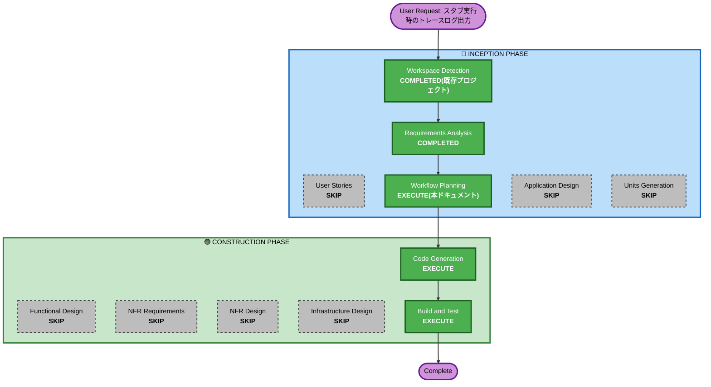

# Execution Plan: スタブ実行時のトレースログ出力

## Detailed Analysis Summary

### Transformation Scope (Brownfield Only)
- **Transformation Type**: Single component change(`lib`モジュール内、`StubResolver`1クラスへのログ追加)
- **Primary Changes**: `StubResolver.getStubInvocation(Method)`のラムダ内(スクリプト評価箇所)にSLF4J TRACEログを追加
- **Related Components**: なし(`StubResolver`の呼出し元である`StubInterceptor`/`StubAspect`はシグネチャ変更を伴わないため無影響)

### Change Impact Assessment
- **User-facing changes**: No — 内部ログの追加のみ、REST API・戻り値の挙動は変更しない
- **Structural changes**: No — 新規クラス・パッケージ変更なし
- **Data model changes**: No
- **API changes**: No
- **NFR impact**: No — 既存の観測性(SLF4J)の仕組みをそのまま利用。新規NFR要件・技術選定は不要

### Component Relationships (Brownfield Only)
- **Primary Component**: `lib/src/main/java/cherry/testtool/stub/StubResolver.java`
- **Dependent Components**: `StubInterceptor`(`@Deprecated`)・`demo`の`StubAspect`(いずれも`StubResolver.getStubInvocation(...)`の戻り値`StubInvocation`を実行するのみで、シグネチャ変更が無いため無影響)
- **Supporting Components**: 既存のSLF4J実行環境(`StubConfigLoader`で既に利用中、追加依存不要)

### Risk Assessment
- **Risk Level**: Low(単一クラス内のログ追加のみ、既存の戻り値・例外変換ロジックは変更しない)
- **Rollback Complexity**: Easy(ログ文の削除のみで復元可能)
- **Testing Complexity**: Simple(既存テスト回帰確認 + ログ出力自体の確認)

## Workflow Visualization



### Text Alternative
```
INCEPTION
- Workspace Detection: COMPLETED(既存プロジェクトを再利用)
- Requirements Analysis: COMPLETED(FR9)
- User Stories: SKIP(内部ログ追加のみ、ユーザー向け機能変更なし)
- Workflow Planning: EXECUTE(本ドキュメント)
- Application Design: SKIP(既存コンポーネント境界内の変更)
- Units Generation: SKIP(既存lib Unit内の単純な変更)

CONSTRUCTION
- Functional Design: SKIP(新規業務ロジック・ドメインモデルなし)
- NFR Requirements/NFR Design: SKIP(既存の観測性の仕組みで充足、新規NFR無し)
- Infrastructure Design: SKIP(インフラ変更無し)
- Code Generation: EXECUTE(StubResolverへのログ追加)
- Build and Test: EXECUTE(lib回帰テスト + ログ出力の手動確認)
```

## Phases to Execute

### 🔵 INCEPTION PHASE
- [x] Workspace Detection (COMPLETED — 既存プロジェクト継続)
- [x] Requirements Analysis (COMPLETED — requirements.md FR9)
- [x] User Stories (SKIPPED)
  - **Rationale**: 内部ログ出力の強化のみで、ユーザー向け機能・画面・APIの変更を伴わないため
- [x] Execution Plan (本ドキュメント、IN PROGRESS)
- [ ] Application Design - SKIP
  - **Rationale**: 既存コンポーネント(`StubResolver`)の境界内の変更であり、新規コンポーネント・メソッドの追加を伴わないため
- [ ] Units Generation - SKIP
  - **Rationale**: 既存`lib` Unit内の単一クラスへの単純な変更であり、新規Unit分解は不要なため

### 🟢 CONSTRUCTION PHASE
- [ ] Functional Design - SKIP
  - **Rationale**: 新規業務ロジック・ドメインモデルを伴わないため(FR9で仕様は確定済み)
- [ ] NFR Requirements - SKIP
  - **Rationale**: 既存のSLF4Jによる観測性の仕組みで充足し、新規NFR要件・技術選定が不要なため
- [ ] NFR Design - SKIP
  - **Rationale**: NFR Requirementsをスキップしたため
- [ ] Infrastructure Design - SKIP
  - **Rationale**: インフラ・デプロイ構成の変更を伴わないため
- [ ] Code Generation - EXECUTE (ALWAYS)
  - **Rationale**: FR9の実装(`StubResolver`へのログ追加)が必要
- [ ] Build and Test - EXECUTE (ALWAYS)
  - **Rationale**: `lib`回帰テスト(既存31テスト)の再確認、および新規ログ出力の動作確認が必要

### 🟡 OPERATIONS PHASE
- [ ] Operations - PLACEHOLDER

## Estimated Timeline
- **Total Stages**: 2実行(Code Generation、Build and Test) + 5スキップ
- **Estimated Duration**: 数分〜十数分(単一クラスへのログ追加のため)

## Success Criteria
- **Primary Goal**: スタブ実行時にTRACEレベルで、対象メソッド・スタブ設定・引数・評価結果がログ出力される
- **Key Deliverables**: `StubResolver.java`の修正、既存テストの回帰確認、ログ出力の動作確認
- **Quality Gates**: `./gradlew :lib:build`成功(既存31テスト回帰無し)、TRACEログ有効化時に想定通りの内容が出力されることを確認
