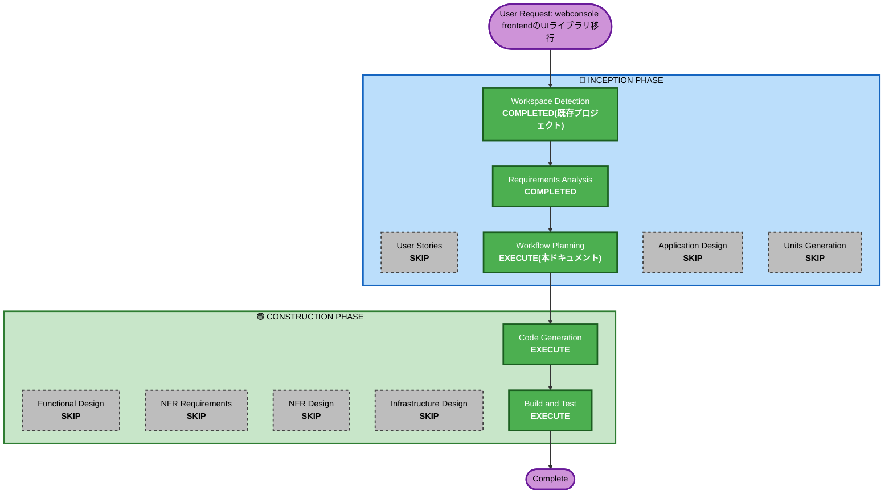

# Execution Plan: webconsole frontendのUIライブラリ移行(make-you-chic-uiへの切替)

## Detailed Analysis Summary

### Transformation Scope (Brownfield Only)
- **Transformation Type**: Single component change(既存4Unit中`client/webconsole`(frontend)のみに影響。新規Unit分解は不要)
- **Primary Changes**:
  - `client/webconsole/frontend`: UIライブラリを`@mui/material`+`@emotion/styled`から`make-you-chic-ui`へ全面置換
  - 対象画面3つ(`Home`・`Invoker`・`Stubconfig`)のコンポーネント置換、`AppShell`(Sidebarナビゲーション+Topbarテーマ選択)導入、Home画面へのCard型ナビゲーション追加
  - `src`配下をコロケーション方式のディレクトリ構成へ再編、`src/assets`配下の静的ファイルを`public/`へ移動
- **Related Components**: `client/webconsole/frontend/vendor/make-you-chic-ui`(submodule。Topbar拡張ポイント(`topbarStart`/`topbarEnd`)の追加はユーザーにより既に実装・push・取り込み済み、FR11.9)

### Change Impact Assessment
- **User-facing changes**: Yes(見た目の刷新に加え、Sidebar/Home Cardによる画面間ナビゲーションの新設、Topbarでのテーマ切替という新機能を含む)
- **Structural changes**: Yes(`src`配下のディレクトリ構成再編を伴うが、`client/webconsole`という既存Unit境界・バックエンド(`GatewayRouteConfig`等)は変更しない)
- **Data model changes**: No
- **API changes**: No(バックエンドの`/testtool/**`等のAPIパス・パラメータは変更しない。フロントエンドからのAPI呼び出し方法(`invoker/api.ts`・`stubconfig/api.ts`)も変更しない)
- **NFR impact**: No(新規のパフォーマンス・セキュリティ・スケーラビリティ要件は無し。デスクトップブラウザのみを対象とする既存方針を継続)

### Component Relationships (Brownfield Only)
- **Primary Component**: `client/webconsole/frontend`(`src/App.tsx`・`src/main.tsx`・`src/Home.tsx`・`src/invoker/`・`src/stubconfig/`・`package.json`・`index.html`)
- **Infrastructure Components**: なし
- **Shared Components**: なし(webconsoleのbackend(`GatewayRouteConfig`等)・`lib`・`demo`・`client/cli`はいずれも無関係)
- **Dependent Components**: なし(frontendのビルド成果物に依存する他コンポーネントは無い)
- **Supporting Components**: `client/webconsole/frontend/vendor/make-you-chic-ui`(submodule、Requirements Analysis中に必要な拡張(`topbarStart`/`topbarEnd`)まで更新済み。追加の変更は不要)

### Risk Assessment
- **Risk Level**: Medium(変更自体はfrontend 1コンポーネントに閉じるが、UIライブラリの全面置換+ディレクトリ再編により変更対象ファイル数が多く、見た目・操作感が大きく変わるため)
- **Rollback Complexity**: Easy(`client/webconsole/frontend`のみのgit差分を戻せばよく、バックエンド・他Unitへの影響が無いため)
- **Testing Complexity**: Moderate(3画面それぞれの表示・操作(Bean/メソッド解決、実行、スタブ設定)の手動確認に加え、AppShellナビゲーション・Home Cardリンク・Topbarテーマ切替の新規UI動線の確認が必要)

## Workflow Visualization



### Text Alternative
```
INCEPTION
- Workspace Detection: COMPLETED(既存プロジェクトを再利用)
- Requirements Analysis: COMPLETED(FR11.1-11.11)
- User Stories: SKIP(単一ユーザー種別のローカル開発ツールという既存方針を継続。UI刷新だが新規ユーザーシナリオ・複数ペルソナは発生しない)
- Workflow Planning: EXECUTE(本ドキュメント)
- Application Design: SKIP(新規コンポーネント/サービスは無く、既存`client/webconsole`Unit境界内の実装。画面構成・データフローはRequirements AnalysisのFR11.1-11.11で既に確定済み)
- Units Generation: SKIP(新規Unit不要、既存`client/webconsole`Unit内で完結)

CONSTRUCTION
- Functional Design: SKIP(新規業務ロジック・ドメインモデルなし。UIコンポーネント置換とディレクトリ再編が中心)
- NFR Requirements/NFR Design: SKIP(技術スタック(React/Vite/TypeScript)は変更なし、新規NFRなし)
- Infrastructure Design: SKIP(インフラ・デプロイ構成の変更なし)
- Code Generation: EXECUTE(client/webconsole/frontendの単一コンポーネント内で完結する計画として実施)
- Build and Test: EXECUTE(frontendのビルド確認+3画面の手動結合確認)
```

## Phases to Execute

### 🔵 INCEPTION PHASE
- [x] Workspace Detection (COMPLETED — 既存プロジェクト継続)
- [x] Requirements Analysis (COMPLETED — requirements.md FR11.1-11.11)
- [x] User Stories (SKIPPED)
  - **Rationale**: 単一ユーザー種別のローカル開発ツールという既存プロジェクト全体の方針(2026-08-07決定)を継続。UI刷新ではあるが新規の業務シナリオ・複数ペルソナ・受入基準の整理を要する変更ではないため
- [x] Execution Plan (本ドキュメント、IN PROGRESS)
- [ ] Application Design - SKIP
  - **Rationale**: 新規コンポーネント・サービス層は発生せず、既存`client/webconsole`Unit境界内の実装。画面構成・使用コンポーネント・ディレクトリ構成はRequirements Analysis(FR11.1-11.11)で既に具体的に確定しており、追加の設計判断は残っていない
- [ ] Units Generation - SKIP
  - **Rationale**: 新規Unitは不要。既存`client/webconsole`Unit内で完結する単一コンポーネントの変更のため、Module Update Strategy(複数Unit間の調整)も不要

### 🟢 CONSTRUCTION PHASE
- [ ] Functional Design - SKIP
  - **Rationale**: 新規業務ロジック・ドメインモデルを伴わない。UIコンポーネントの置換とディレクトリ再編が中心で、既存の業務仕様(Bean/メソッド呼出し、スタブ設定)への変更は無い
- [ ] NFR Requirements - SKIP
  - **Rationale**: 技術スタック(React 19/Vite/TypeScript)は変更なし。デスクトップブラウザのみ対象という既存方針(NFR9相当)を継続し、新規のパフォーマンス・セキュリティ・スケーラビリティ要件は発生しない
- [ ] NFR Design - SKIP
  - **Rationale**: NFR Requirementsをスキップしたため
- [ ] Infrastructure Design - SKIP
  - **Rationale**: インフラ・デプロイ構成の変更を伴わないため
- [ ] Code Generation - EXECUTE (ALWAYS)
  - **Rationale**: FR11.1-11.11の実装(依存関係変更・ディレクトリ再編・3画面のコンポーネント置換・AppShell導入等)が必要。`client/webconsole/frontend`単一コンポーネント内で完結する計画として実施する
- [ ] Build and Test - EXECUTE (ALWAYS)
  - **Rationale**: `npm run build`(TypeScriptコンパイル+Vite build)の成功確認に加え、3画面(Home/Invoker/Stubconfig)の表示・操作、AppShellナビゲーション・Home Card遷移・Topbarテーマ切替という新規UI動線の手動結合確認が必要

### 🟡 OPERATIONS PHASE
- [ ] Operations - PLACEHOLDER

## Estimated Timeline
- **Total Stages**: 2実行(Code Generation、Build and Test) + 7スキップ
- **Estimated Duration**: 数十分〜1時間程度(単一コンポーネントだが変更対象ファイル数が多いため)

## Success Criteria
- **Primary Goal**: `client/webconsole/frontend`が`@mui/material`・`@emotion/styled`に依存せず、`make-you-chic-ui`のみでHome/Invoker/Stubconfigの3画面が従来と同等の機能(Bean/メソッド解決、実行、スタブ設定の登録・確認)を提供する
- **Key Deliverables**:
  - `package.json`(MUI依存削除、`@fontsource/noto-sans-jp`・`noto-serif-jp`追加)
  - `src/main.tsx`(Theme/Toast/ModalStackProvider・Webフォントimport)
  - `src/layouts/AppShellLayout.tsx`(新設)
  - `src/pages/Home/HomePage.tsx`・`src/pages/Invoker/InvokerPage.tsx`・`src/pages/Stubconfig/StubconfigPage.tsx`(+各`.css`・`api.ts`)
  - `src/lib/common.ts`(旧`common.ts`)
  - `public/`配下への静的ファイル移動、`index.html`の参照パス更新
- **Quality Gates**: `npm run build`成功(TypeScript型チェック含む)、`npm run lint`成功、3画面の手動結合確認(demo起動+webconsole経由でのBean呼出し・スタブ設定・AppShellナビゲーション・Home Card遷移・Topbarテーマ切替)
