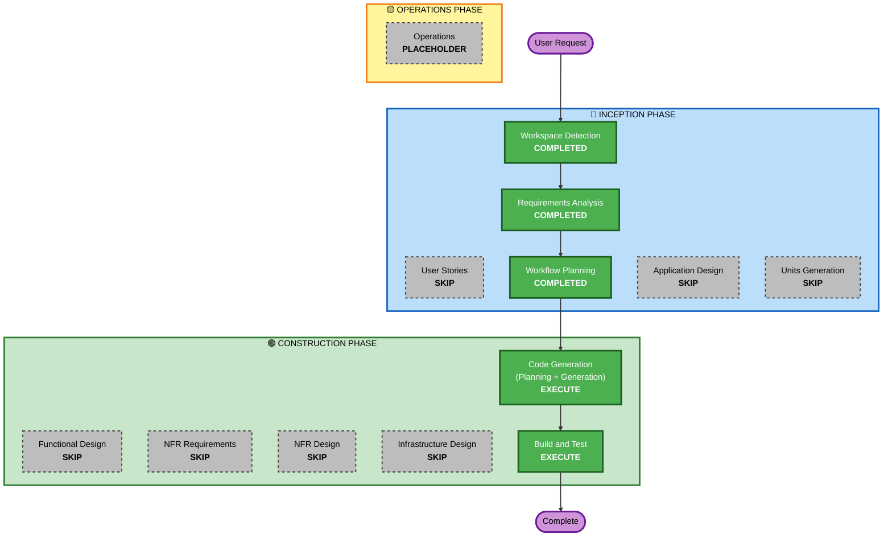

# Execution Plan: webconsole Basic認証追加(FR13)

## Detailed Analysis Summary

### Transformation Scope (Brownfield)
- **Transformation Type**: 単一コンポーネント変更(既存`client/webconsole`Unit境界内)
- **Primary Changes**: `spring-boot-starter-security`依存追加、専用プロパティ(`cherry.testtool.web.auth.username`/`password`)によるBasic認証の条件付き有効化、既存E2Eテストへの専用シナリオ追加
- **Related Components**: `e2e/`(専用E2Eシナリオ追加のみ、既存シナリオへの変更なし)

### Change Impact Assessment
- **User-facing changes**: Yes — webconsoleアクセス時にBasic認証情報の入力が必要になる(認証情報設定時のみ、未設定時は現状通り)
- **Structural changes**: No — 新規コンポーネント・パッケージ構成の変更なし。既存`client/webconsole`内へのSecurity設定クラス追加のみ
- **Data model changes**: No
- **API changes**: No — 既存の`/testtool/**`APIのパス・パラメータに変更なし。アクセス制御が追加されるのみ
- **NFR impact**: Yes(セキュリティ) — webconsoleへの不正アクセスを防止する。技術スタック(Spring Security)は確認質問で確定済みのため、NFR Requirements/NFR Designステージでの追加検討は不要

### Component Relationships (Brownfield)
- **Primary Component**: `client/webconsole`(backend、Spring Boot)
- **Shared Components**: なし(`lib`・`demo`・`client/cli`への変更は無し。FR10のAPIキー保護と異なり、webconsole自体へのアクセス制御のためlib/demoは無関係)
- **Dependent Components**: なし(webconsoleを呼び出す側は存在しない、ブラウザからの直接アクセスのみ)
- **Supporting Components**: `e2e/`(専用E2Eシナリオ追加)

### Risk Assessment
- **Risk Level**: Low — 単一モジュール内の変更、既存のFR10(APIキー保護)と同じ設計パターンを踏襲、未設定時は既存動作を維持(後方互換)
- **Rollback Complexity**: Easy — 依存・設定クラスの削除で容易に戻せる
- **Testing Complexity**: Simple — 専用ポートでの自己完結型E2Eシナリオ追加(既存パターンの踏襲)

## Workflow Visualization

## Phases to Execute

### 🔵 INCEPTION PHASE
- [x] Workspace Detection (COMPLETED — 既存)
- [x] Requirements Analysis (COMPLETED)
- [x] User Stories (SKIPPED — 単一ユーザー種別のローカル開発ツール、既存Unit判断を踏襲)
- [x] Execution Plan (IN PROGRESS — 本ドキュメント)
- [ ] Application Design - SKIP
  - **Rationale**: 新規コンポーネント・サービスなし。既存`client/webconsole`Unit境界内へのSecurity設定クラス追加のみ
- [ ] Units Generation - SKIP
  - **Rationale**: 新規データモデル・複数モジュールにまたがる変更ではない。単一Unit(webconsole)内の変更

### 🟢 CONSTRUCTION PHASE
- [ ] Functional Design - SKIP
  - **Rationale**: 新規業務ロジック・ドメインモデルなし。Spring Securityの標準的な設定のみ
- [ ] NFR Requirements - SKIP
  - **Rationale**: 技術スタック(Spring Security)は確認質問で確定済み
- [ ] NFR Design - SKIP
  - **Rationale**: NFR Requirementsをスキップしたため不要
- [ ] Infrastructure Design - SKIP
  - **Rationale**: クラウド/IaC対象外(既存方針を踏襲)
- [ ] Code Generation - EXECUTE (ALWAYS)
  - **Rationale**: 実装計画立案・コード生成が必要
- [ ] Build and Test - EXECUTE (ALWAYS)
  - **Rationale**: ビルド・テスト・実機検証が必要

### 🟡 OPERATIONS PHASE
- [ ] Operations - PLACEHOLDER

## Estimated Timeline
- **Total Phases**: 2(Code Generation、Build and Test)
- **Estimated Duration**: 数時間(単一モジュール、既存パターン踏襲のため小規模)

## Success Criteria
- **Primary Goal**: webconsole全体にBasic認証を追加し、未設定時は既存動作(認証なし)を維持する
- **Key Deliverables**: Security設定クラス、専用E2Eシナリオ、README更新
- **Quality Gates**: `./gradlew build`全モジュール成功、`npm run test:e2e`(no-key/with-keyとも)成功、実ブラウザでBasic認証ダイアログの表示・認証成功/失敗を確認
