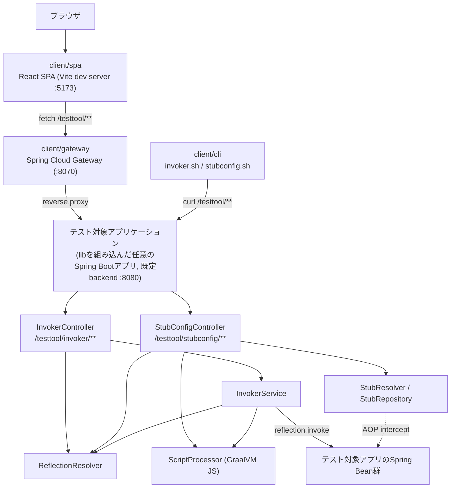
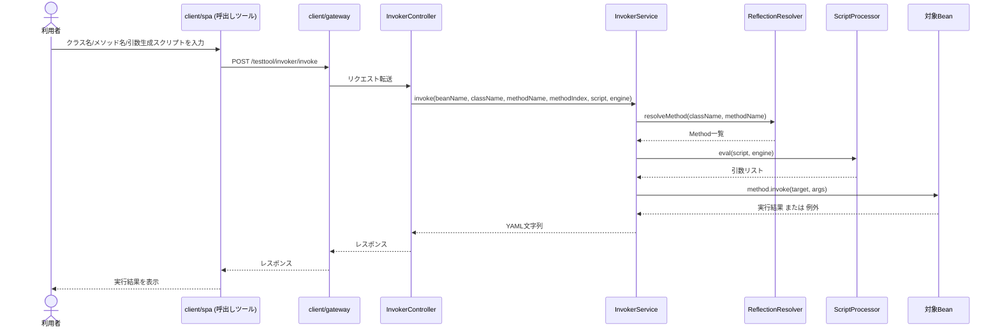
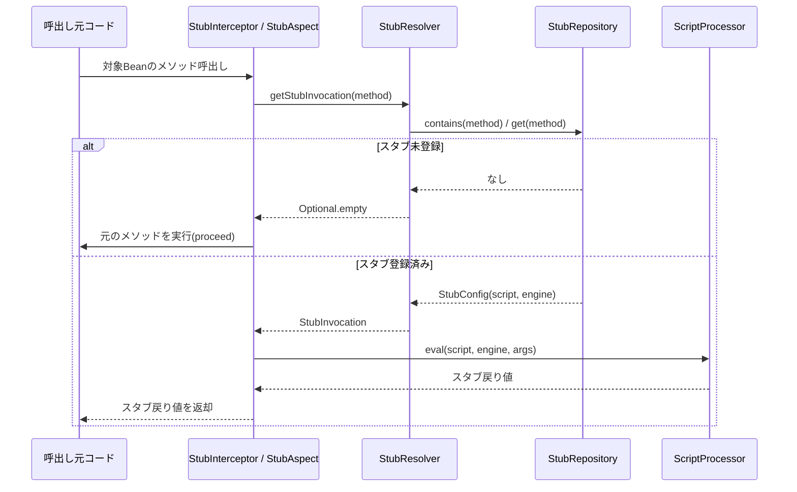

# System Architecture

## System Overview

cherry-testtoolは4つの独立したビルドモジュールで構成される。`lib`はテスト対象のSpring Bootアプリケーションに組み込まれるライブラリで、メソッド呼出しとAOPスタブのREST APIを提供する。`client/gateway`はブラウザからのアクセスをテスト対象アプリへ中継するSpring Cloud Gateway。`client/spa`はReact製のWeb UI。`client/cli`はシェルスクリプトによるCLIツール。各モジュール間はビルド時の依存関係を持たず、HTTP経由の実行時連携のみで結合している。

## Architecture Diagram



### テキスト代替
```
[ブラウザ] -> [client/spa :5173] -> [client/gateway :8070] -> [テスト対象アプリ :8080]
[client/cli] -> [テスト対象アプリ :8080] (gatewayを経由しない)
[テスト対象アプリ] 内部: InvokerController/StubConfigController -> InvokerService/StubResolver
  -> ReflectionResolver, ScriptProcessor(GraalVM JS) -> 対象Bean群(reflection呼出し / AOP介入)
```

## Component Descriptions

### lib
- **Purpose**: 動的メソッド呼出しとAOPスタブ機能を提供する自動構成ライブラリ。
- **Responsibilities**: `TesttoolConfiguration`によるBean定義、REST Controller提供、AOPインターセプタ提供。
- **Dependencies**: Spring Boot, Spring AOP/AspectJ, GraalVM JS, Jackson(YAML), commons-lang3, commons-collections4。
- **Type**: Shared Library(Spring Boot自動構成ライブラリ)。

### client/gateway
- **Purpose**: SPAとテスト対象アプリ間のリバースプロキシ。
- **Responsibilities**: `/**`へのルーティング、CORS許可、セキュリティヘッダ付与、レスポンスヘッダ重複排除。
- **Dependencies**: Spring Cloud Gateway(WebFlux版)、Spring Boot Actuator、Micrometer Tracing(Brave)。
- **Type**: Application(APIゲートウェイ)。

### client/spa
- **Purpose**: メソッド呼出し・スタブ設定のWeb UI。
- **Responsibilities**: `/`(Home)、`/invoker`(呼出しツール)、`/stubconfig`(スタブ設定ツール)の3画面提供。
- **Dependencies**: React 19, MUI, react-router-dom, Vite。
- **Type**: Application(フロントエンド)。

### client/cli
- **Purpose**: スクリプトファイル群を使ったメソッド呼出し・スタブ設定の一括実行。
- **Responsibilities**: ディレクトリ走査、ファイル名からのクラス名/メソッド名/インデックス抽出、curlによるREST API呼出し。
- **Dependencies**: bash, curl。
- **Type**: Client(CLIツール)。

## Data Flow

### メソッド呼出し(Invoke)



### スタブ介入実行



## Integration Points

- **External APIs**: なし(cherry-testtool自身がREST APIを提供する側であり、外部サービスは呼び出さない)。
- **Databases**: なし。スタブ設定は`StubRepositoryImpl`のインメモリ`HashMap`で保持し、永続化されない(アプリ再起動でリセットされる)。
- **Third-party Services**: GraalVM JavaScriptエンジン(埋め込み実行、外部サービスではない)。

## Infrastructure Components

- **CDK Stacks**: なし(IaC定義は未検出)。
- **Deployment Model**: ローカル/開発環境での手動起動を前提(`./gradlew bootRun`、`npm run dev`)。本番デプロイ構成やコンテナ定義は未検出。
- **Networking**: `client/gateway`のCORS設定でVite開発サーバのポート(5173, 4173)を許可。ゲートウェイは`:8070`、既定のバックエンドは`:8080`を想定。
