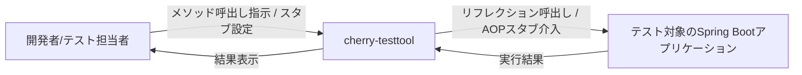

# Business Overview

## Business Context Diagram



### テキスト代替
```
[開発者/テスト担当者] --指示--> [cherry-testtool] --リフレクション呼出し/AOPスタブ介入--> [テスト対象アプリ]
[テスト対象アプリ] --実行結果--> [cherry-testtool] --結果表示--> [開発者/テスト担当者]
```

## Business Description

- **Business Description**: cherry-testtoolは、Spring Bootアプリケーションを対象にした動的テストツールである。テスト対象アプリに`lib`モジュールを組み込むことで、任意のSpring Beanのメソッドをリフレクションで動的に呼び出したり、AOPによってメソッドの戻り値をJavaScript(GraalVM JS)で記述したスタブに差し替えたりできる。Web UI(React SPA)とCLI(シェルスクリプト)の両方から操作可能。
- **Business Transactions**:
  1. **メソッド呼出し(Invoke)** — クラス名・メソッド名・メソッドインデックスを指定し、JavaScriptで生成した引数リストを使って対象Beanのメソッドをリフレクション呼出しし、結果をYAML形式の文字列で取得する。
  2. **Bean名解決(Resolve Bean)** — 指定したクラスに対応するSpring Bean名の一覧を取得する。
  3. **メソッド解決(Resolve Method)** — 指定したクラス・メソッド名に対応する(オーバーロードを含む)メソッドシグネチャ一覧を取得する。
  4. **スタブ登録(Put Stub)** — 指定したメソッドに対して、戻り値を生成するJavaScriptとエンジン名を登録する。スクリプトを空にするとスタブを解除する。
  5. **スタブ参照(Get Stub)** — 登録済みスタブのスクリプト・エンジン・現在の評価結果を取得する。
  6. **スタブ一覧(List Stub)** — 登録済みスタブの対象メソッド一覧を取得する。
  7. **スタブ介入実行** — AOP(StubInterceptor / StubAspect)により、登録済みスタブがあれば元のメソッド実行をスキップしてスタブのスクリプト評価結果を返す。
- **Business Dictionary**:
  - **Bean**: Spring管理下のオブジェクトインスタンス。呼出し/スタブの対象。
  - **Method Index**: 同名のオーバーロードメソッドが複数存在する場合に、何番目のメソッドかを指定するための0始まりのインデックス。
  - **Script**: 引数生成またはスタブ戻り値生成のために実行されるJavaScript(既定エンジンはGraalVM JS)。
  - **Engine**: スクリプト実行エンジン名。未指定時はJVM上で見つかった最初のスクリプトエンジン(通常GraalVM JS)が使われる。
  - **Stub**: AOPによって本来のメソッド実行を横取りし、指定スクリプトの評価結果を戻り値とする仕組み。

## Component Level Business Descriptions

### lib
- **Purpose**: メソッド呼出しとスタブ機能を提供するSpring Boot自動構成ライブラリ。テスト対象アプリに依存関係として追加することで機能を組み込む。
- **Responsibilities**: リフレクションによる動的メソッド呼出し、AOPベースのスタブ介入、GraalVM JSによるスクリプト実行、REST APIの提供。

### client/gateway
- **Purpose**: SPAからのリクエストをテスト対象アプリ(バックエンド)へ中継するAPIゲートウェイ。
- **Responsibilities**: リバースプロキシ、CORS設定、レスポンスヘッダの重複排除。

### client/spa
- **Purpose**: メソッド呼出しとスタブ設定をブラウザから操作するためのWeb UI。
- **Responsibilities**: 呼出しツール画面・スタブ設定ツール画面の提供、REST APIの呼出し。

### client/cli
- **Purpose**: あらかじめ用意したJavaScriptファイル群を使い、メソッド呼出し・スタブ設定を一括実行するコマンドラインツール。
- **Responsibilities**: ディレクトリ配下のスクリプトファイルを走査し、ファイル名からクラス名・メソッド名・メソッドインデックスを抽出してREST APIを呼び出す。
