# Code Structure

## Build System

- **Type**: Gradle(`lib`、`client/gateway`)、npm/Vite(`client/spa`)。`client/cli`はビルド不要のシェルスクリプト。
- **Configuration**:
  - `lib/build.gradle` — java-library, io.spring.dependency-management, Spring Boot BOMインポート(Bootプラグイン自体は適用しない=ライブラリ用途)。
  - `lib/settings.gradle` — `rootProject.name = "cherry-testtool"`。
  - `client/gateway/build.gradle` — java-library, io.spring.dependency-management, org.springframework.boot(4.1.0)プラグイン適用、Spring Boot BOM + Spring Cloud BOMインポート。
  - `client/gateway`には`settings.gradle`が存在しない(Gradle既定のルートプロジェクト名が使用される)。
  - `client/spa/package.json` — Vite + TypeScript + React、npmスクリプト(dev/build/lint/preview/clean)。
  - `lib`と`client/gateway`は別々の独立したGradleビルドであり、マルチプロジェクト構成にはなっていない。

## Key Classes/Modules

```mermaid
flowchart TB
    subgraph lib_invoker["cherry.testtool.invoker"]
        InvokerService["InvokerService (interface)"]
        InvokerServiceImpl["InvokerServiceImpl"]
    end
    subgraph lib_reflect["cherry.testtool.reflect"]
        ReflectionResolver["ReflectionResolver (interface)"]
        ReflectionResolverImpl["ReflectionResolverImpl"]
    end
    subgraph lib_script["cherry.testtool.script"]
        ScriptProcessor["ScriptProcessor (interface)"]
        ScriptProcessorImpl["ScriptProcessorImpl"]
    end
    subgraph lib_stub["cherry.testtool.stub"]
        StubConfig["StubConfig (record)"]
        StubConfigLoader["StubConfigLoader"]
        StubRepository["StubRepository (interface)"]
        StubRepositoryImpl["StubRepositoryImpl"]
        StubResolver["StubResolver (interface)"]
        StubResolverImpl["StubResolverImpl"]
        StubInterceptor["StubInterceptor"]
        StubInvocation["StubInvocation (functional interface)"]
    end
    subgraph lib_util["cherry.testtool.util"]
        ReflectionUtil["ReflectionUtil"]
        ToMapUtil["ToMapUtil"]
    end
    subgraph lib_web["cherry.testtool.web"]
        InvokerController["InvokerController"]
        StubConfigController["StubConfigController"]
    end
    TesttoolConfiguration["TesttoolConfiguration (@Configuration)"]

    TesttoolConfiguration --> InvokerServiceImpl
    TesttoolConfiguration --> ReflectionResolverImpl
    TesttoolConfiguration --> ScriptProcessorImpl
    TesttoolConfiguration --> StubRepositoryImpl
    TesttoolConfiguration --> StubConfigLoader
    TesttoolConfiguration --> StubResolverImpl

    InvokerServiceImpl -.implements.-> InvokerService
    ReflectionResolverImpl -.implements.-> ReflectionResolver
    ScriptProcessorImpl -.implements.-> ScriptProcessor
    StubRepositoryImpl -.implements.-> StubRepository
    StubResolverImpl -.implements.-> StubResolver

    InvokerController --> InvokerService
    InvokerController --> ReflectionResolver
    StubConfigController --> StubRepository
    StubConfigController --> ScriptProcessor
    StubConfigController --> ReflectionResolver
    StubInterceptor --> StubResolver
```

### Existing Files Inventory

**lib (メインソース)**
- `lib/src/main/java/cherry/testtool/TesttoolConfiguration.java` - 全Beanを定義するSpring自動構成クラス
- `lib/src/main/java/cherry/testtool/invoker/InvokerService.java` - メソッド呼出しサービスのインタフェース
- `lib/src/main/java/cherry/testtool/invoker/InvokerServiceImpl.java` - リフレクション呼出し・スクリプトによる引数生成・YAML整形の実装
- `lib/src/main/java/cherry/testtool/reflect/ReflectionResolver.java` - Bean名/メソッド解決インタフェース
- `lib/src/main/java/cherry/testtool/reflect/ReflectionResolverImpl.java` - ApplicationContextベースの解決実装
- `lib/src/main/java/cherry/testtool/script/ScriptProcessor.java` - スクリプト実行インタフェース
- `lib/src/main/java/cherry/testtool/script/ScriptProcessorImpl.java` - `ScriptEngineManager`によるJS実行実装(GraalVM JSバインディング設定含む)
- `lib/src/main/java/cherry/testtool/stub/StubConfig.java` - スタブ設定(script, engine)を保持するrecord
- `lib/src/main/java/cherry/testtool/stub/StubConfigLoader.java` - ディレクトリ配下のスクリプトファイルを一括読込みしてリポジトリへ登録
- `lib/src/main/java/cherry/testtool/stub/StubInterceptor.java` - AOP Alliance `MethodInterceptor`実装によるスタブ介入
- `lib/src/main/java/cherry/testtool/stub/StubInvocation.java` - スタブ実行を表す関数型インタフェース
- `lib/src/main/java/cherry/testtool/stub/StubRepository.java` - スタブ設定の登録・参照インタフェース
- `lib/src/main/java/cherry/testtool/stub/StubRepositoryImpl.java` - インメモリ`HashMap`によるスタブ設定保持
- `lib/src/main/java/cherry/testtool/stub/StubResolver.java` - `Method`/`MethodInvocation`/`ProceedingJoinPoint`からスタブ実行を解決するインタフェース
- `lib/src/main/java/cherry/testtool/stub/StubResolverImpl.java` - スタブ設定をスクリプト実行に変換する実装
- `lib/src/main/java/cherry/testtool/util/ReflectionUtil.java` - クラス名・メソッドシグネチャの文字列表現生成
- `lib/src/main/java/cherry/testtool/util/ToMapUtil.java` - `Throwable`を`Map`(type/message/stackTrace/cause)に変換
- `lib/src/main/java/cherry/testtool/web/InvokerController.java` - `/testtool/invoker/**` REST Controller
- `lib/src/main/java/cherry/testtool/web/StubConfigController.java` - `/testtool/stubconfig/**` REST Controller
- `lib/src/main/resources/META-INF/spring.factories` - `EnableAutoConfiguration`への`TesttoolConfiguration`登録

**lib (テストソース)**
- `lib/src/test/java/cherry/testtool/ToolTester.java` / `ToolTesterImpl.java` - リフレクション呼出し・スタブ機能検証用のテストフィクスチャインタフェース/実装
- `lib/src/test/java/cherry/testtool/StubAspect.java` - AspectJ `@Around`によるテスト用スタブアスペクト(`StubInterceptor`とは別方式)
- `lib/src/test/java/cherry/testtool/TestMain.java` - テスト用Spring Bootエントリポイント(XML ApplicationContextを追加importResource)
- `lib/src/test/java/cherry/testtool/invoker/InvokerServiceTest.java` - `InvokerServiceImpl`の単体テスト
- `lib/src/test/java/cherry/testtool/reflect/ReflectionResolverTest.java` - `ReflectionResolverImpl`の単体テスト
- `lib/src/test/java/cherry/testtool/script/ScriptProcessorTest.java` - `ScriptProcessorImpl`の単体テスト(GraalVM JS破壊的変更検出含む)
- `lib/src/test/java/cherry/testtool/stub/StubInterceptorTest.java` - `StubInterceptor`の単体テスト
- `lib/src/test/java/cherry/testtool/stub/StubRepositoryTest.java` - `StubRepositoryImpl`の単体テスト
- `lib/src/test/resources/application.properties`、`spring/appctx-stub.xml`、`spring/appctx-trace.xml` - テスト実行用設定

**client/gateway**
- `client/gateway/src/main/java/cherry/testtool/gateway/Main.java` - Spring Bootエントリポイント
- `client/gateway/src/main/resources/application.properties` - ポート・CORS・ルーティング・ログ設定

**client/spa**
- `client/spa/src/main.tsx` - Reactルートエントリ、`BrowserRouter`でラップ
- `client/spa/src/App.tsx` - ルーティング定義(`/`, `/invoker`, `/stubconfig`)
- `client/spa/src/Home.tsx` - トップページ
- `client/spa/src/common.ts` - APIベースURL解決(`VITE_TESTTOOL_ROOT`環境変数)
- `client/spa/src/invoker/App.tsx` / `api.ts` - 呼出しツール画面とAPIクライアント
- `client/spa/src/stubconfig/App.tsx` / `api.ts` - スタブ設定ツール画面とAPIクライアント
- `client/spa/vite.config.ts`、`eslint.config.js`、`tsconfig*.json` - ビルド/Lint/型設定

**client/cli**
- `client/cli/invoker.sh` - スクリプトディレクトリを走査し`/testtool/invoker/invoke`を一括呼出し
- `client/cli/stubconfig.sh` - スクリプトディレクトリを走査し`/testtool/stubconfig/{put,get}`を一括呼出し(表示/登録/解除モード)
- `client/cli/invoker/`, `client/cli/invoker2/`, `client/cli/stubconfig/` - サンプルスクリプト配置ディレクトリ(`cherry.testtool.ToolTester/toBeStubbed1.js`)

## Design Patterns

### Interface + Implementation分離
- **Location**: `InvokerService`/`InvokerServiceImpl`、`ReflectionResolver`/`ReflectionResolverImpl`、`ScriptProcessor`/`ScriptProcessorImpl`、`StubRepository`/`StubRepositoryImpl`、`StubResolver`/`StubResolverImpl`
- **Purpose**: テスト容易性と実装差し替えの柔軟性確保
- **Implementation**: 全てSpring `@Bean`メソッド(`TesttoolConfiguration`)でインタフェース型として公開

### AOPによるスタブ介入(2方式併存)
- **Location**: `StubInterceptor`(AOP Alliance `MethodInterceptor`、ライブラリ本体が提供)、`StubAspect`(AspectJ `@Around`、`lib`のテストコードのみで使用)
- **Purpose**: 対象Beanのメソッド呼出しを横取りし、スクリプト評価結果で置き換える
- **Implementation**: `StubResolver.getStubInvocation(...)`のOptionalが空なら`proceed()`、値があればスクリプト実行結果を返却

### 条件付きBean登録
- **Location**: `InvokerController`、`StubConfigController`の`@ConditionalOnWebApplication`/`@ConditionalOnProperty`
- **Purpose**: Servlet環境かつプロパティ有効時のみControllerを登録し、利用側が機能をON/OFF可能にする

### Spring Boot自動構成
- **Location**: `lib/src/main/resources/META-INF/spring.factories`
- **Purpose**: 利用側アプリが`lib`を依存追加するだけで`TesttoolConfiguration`が自動適用される

## Critical Dependencies

### org.graalvm.js:js / js-scriptengine
- **Version**: 25.1.3
- **Usage**: `ScriptProcessorImpl`が`ScriptEngineManager`経由で取得するJavaScriptエンジンの実体
- **Purpose**: 引数生成スクリプト・スタブ戻り値生成スクリプトの実行

### tools.jackson.dataformat:jackson-dataformat-yaml
- **Version**: Spring Boot 4.1.0 BOM管理(Jackson 3.x系、パッケージ名`tools.jackson`)
- **Usage**: `InvokerServiceImpl`/`StubConfigController`が実行結果・例外情報をYAML文字列へシリアライズ
- **Purpose**: 呼出し結果を人間可読な形式でレスポンスとして返す

### org.springframework.boot:spring-boot-starter-aspectj
- **Version**: Spring Boot 4.1.0 BOM管理
- **Usage**: `StubInterceptor`の適用、テストコードの`StubAspect`
- **Purpose**: メソッド呼出しへのAOP介入
