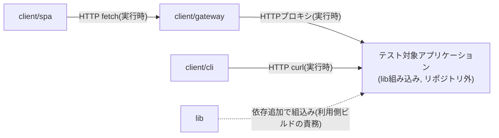

# Dependencies

## Internal Dependencies

`lib`・`client/gateway`・`client/spa`・`client/cli`はGradle/npmのビルド時依存関係を互いに持たない、完全に独立したビルドモジュールである。連携は実行時のHTTP通信のみで成立する。



### テキスト代替
```
client/spa --HTTP fetch(実行時)--> client/gateway --HTTPプロキシ(実行時)--> テスト対象アプリ
client/cli --HTTP curl(実行時)--> テスト対象アプリ (gateway非経由)
lib --依存追加で組込み--> テスト対象アプリ (このリポジトリの外側で発生)
```

### client/spa depends on client/gateway
- **Type**: Runtime(HTTP)
- **Reason**: SPAはビルド時ではなく実行時に`fetch`でゲートウェイのREST APIを呼び出す(`VITE_TESTTOOL_ROOT`環境変数で切替可能)

### client/gateway depends on テスト対象アプリケーション
- **Type**: Runtime(HTTPプロキシ)
- **Reason**: `application.properties`のルーティング設定(`backend.uri`、既定`http://localhost:8080`)で転送先を指定

### client/cli depends on テスト対象アプリケーション
- **Type**: Runtime(curl)
- **Reason**: `-l`オプションで指定したベースURL(既定`http://localhost:8080`)へ直接アクセスし、ゲートウェイを経由しない

### lib depends on テスト対象アプリケーション(逆方向の組込み関係)
- **Type**: Compile(利用側の依存追加による)
- **Reason**: `lib`はこのリポジトリのビルドからは独立しており、テスト対象アプリ側が`lib`をコンパイル依存として追加することで初めて機能する。テスト対象アプリ自体はこのリポジトリに含まれない。

## External Dependencies

### org.springframework.boot:spring-boot-starter 他 Spring Boot BOM
- **Version**: 4.1.0
- **Purpose**: `lib`/`client/gateway`のアプリケーション基盤
- **License**: Apache License 2.0

### org.springframework.cloud:spring-cloud-starter-gateway-server-webflux
- **Version**: Spring Cloud BOM `2025.1.2`管理
- **Purpose**: `client/gateway`のリバースプロキシ機能
- **License**: Apache License 2.0

### org.graalvm.js:js / js-scriptengine
- **Version**: 25.1.3
- **Purpose**: 引数生成・スタブ戻り値生成スクリプトの実行エンジン
- **License**: GraalVM Community Edition配下のライセンス(構成により異なるため要確認)

### tools.jackson.dataformat:jackson-dataformat-yaml
- **Version**: Spring Boot 4.1.0 BOM管理(Jackson 3.x系)
- **Purpose**: 実行結果・例外情報のYAMLシリアライズ
- **License**: Apache License 2.0

### org.apache.commons:commons-lang3 / commons-collections4
- **Version**: commons-collections4は4.5.0固定管理、commons-lang3はSpring Boot BOM管理
- **Purpose**: 文字列判定等のユーティリティ(`StringUtils.isBlank`等)
- **License**: Apache License 2.0

### org.junit.jupiter:junit-jupiter / org.hamcrest:hamcrest / org.mockito:mockito-core
- **Version**: Spring Boot 4.1.0 BOM管理
- **Purpose**: `lib`の単体テスト
- **License**: Eclipse Public License 2.0(JUnit)、BSD-3-Clause(Hamcrest)、MIT(Mockito)

### react / react-dom
- **Version**: ^19.2.7
- **Purpose**: SPAのUIランタイム
- **License**: MIT

### react-router-dom
- **Version**: ^7.18.1
- **Purpose**: SPAのクライアントサイドルーティング
- **License**: MIT

### @mui/material / @emotion/styled
- **Version**: ^9.2.0 / ^11.14.1
- **Purpose**: SPAのUIコンポーネントとスタイリング
- **License**: MIT

### vite / typescript / eslint 一式
- **Version**: vite ^8.1.3、typescript ^6.0.3、eslint ^10.6.0
- **Purpose**: SPAのビルド・型検査・静的解析
- **License**: MIT(いずれも)
