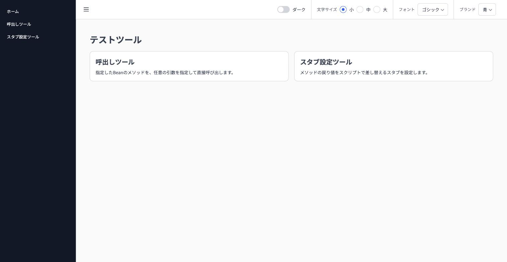
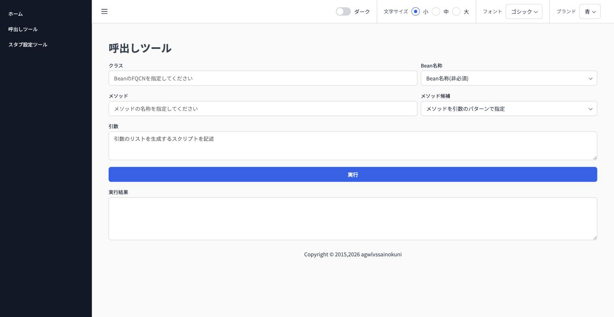
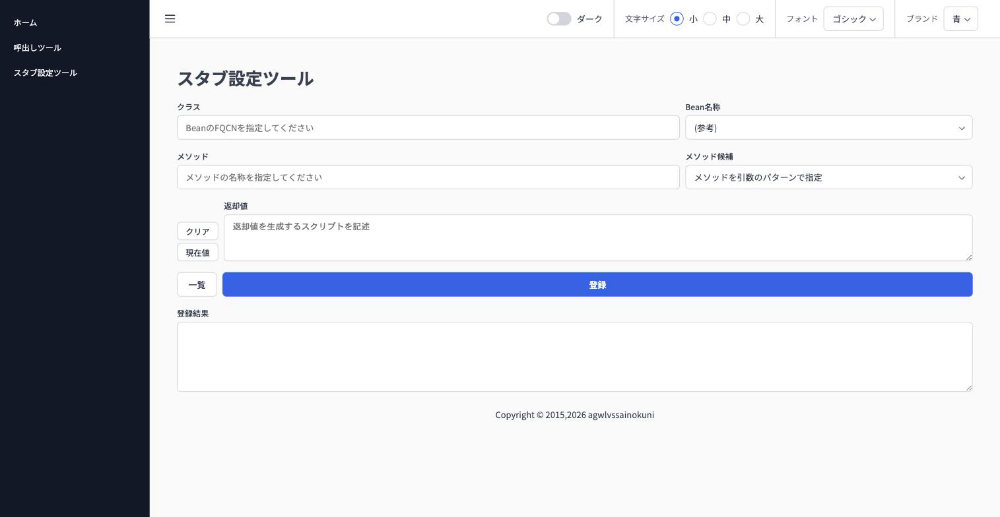

# cherry-testtool-webconsole

`cherry-testtool`のWeb UI(SPA)とAPIプロキシ(Spring Cloud Gateway Server MVC)を1つのSpring Bootアプリケーションへ統合したモジュール。旧`client/gateway`(Spring Cloud Gateway WebFlux版)・`client/spa`(React SPA単体)を置き換える。

## 画面

| ホーム | 呼出しツール | スタブ設定ツール |
|---|---|---|
|  |  |  |

## 構成

- `frontend/` — React SPA本体(旧`client/spa`)。ビルド時(`./gradlew :client:webconsole:build`)に`npm install`→`npm run build`が自動実行され、成果物(`frontend/dist`)が本体jarの`static/`へ組み込まれる
- `WebconsoleApplication` — エントリポイント
- `GatewayRouteConfig` — `/testtool/**`宛のリクエストのみを`backend.uri`(既定は[demo](../../demo)の`8080`)へプロキシするルート定義(Java Functional Route)。旧gatewayの`SecureHeaders`・`DedupeResponseHeader`相当のフィルタも設定する
- `SpaFallbackResourceResolver` / `WebConfig` — 静的リソース(`/testtool/**`以外)が存在しない場合に`index.html`を返す、SPAのブラウザ履歴ベースルーティング向けフォールバック
- `WebSecurityConfig` / `WebAuthProperties` — `cherry.testtool.web.auth.users`が1件以上設定されている場合のみ、本モジュール全体(SPA配信・`/testtool/**`含む全パス)にBasic認証を有効化する。未設定時は認証なしで動作する(既定)

## Basic認証

既定では認証なしで動作する。`application.yml`(または環境変数)へ以下を設定すると、本モジュール全体にBasic認証がかかる。複数ユーザーを登録でき、いずれの認証情報でもアクセスできる。

```yaml
cherry:
  testtool:
    web:
      auth:
        users:
          - username: alice
            password: change-me
          - username: bob
            password: change-me-too
```

`password`は平文、または`{bcrypt}`プレフィックス付きのBCryptハッシュ(例: `{bcrypt}$2a$10$...`)のいずれでも指定できる。プレフィックスが無い場合は平文として照合される。

## 起動方法

`cherry-testtool`リポジトリ全体はGradleマルチプロジェクトであり、本モジュールは`:client:webconsole`として、リポジトリ直下の`./gradlew`から実行する。

```bash
./gradlew :client:webconsole:bootRun
```

既定で`http://localhost:9090`で起動する(SPA・API双方ともこのポートで提供される)。プロキシ先([demo](../../demo)など)は`backend.protocol`/`backend.host`/`backend.port`(既定`http://localhost:8080`)で変更できる。

## 開発時の起動方法(Vite dev server)

フロントエンドを単独で素早く開発したい場合は、Vite dev serverを使う。`vite.config.ts`の`server.proxy`により`/testtool/**`は`http://localhost:9090`(本モジュール自身)へ委譲されるため、CORS設定は不要。

```bash
# 別ターミナルで本体(APIプロキシ)を起動しておく
./gradlew :client:webconsole:bootRun

# フロントエンドをdev serverで起動
cd client/webconsole/frontend
npm install
npm run dev
```

`http://localhost:5173`でアクセスする。

## 手動結合確認手順

自動テストでのプロキシ結合確認(実際にbackendへのHTTP疎通を伴う)は、得られる保証に対して構成が複雑になるため見送り、以下の手動確認手順で代替する。

1. [demo](../../demo)を起動する(`./gradlew :demo:bootRun`、`http://localhost:8080`)
2. 本モジュールを起動する(`./gradlew :client:webconsole:bootRun`、`http://localhost:9090`)
3. ブラウザで`http://localhost:9090`にアクセスし、SPA(`/invoker`・`/stubconfig`)が表示されることを確認する
4. `/invoker`または`/stubconfig`で、対象クラスに`cherry.testtool.demo.SampleService`を指定し、Bean名・メソッド一覧が取得できることを確認する(`/testtool/resolve/**`がdemoへプロキシされていることの確認)
5. 存在しないパス(例: `http://localhost:9090/invoker/some/deep/path`)へ直接アクセスし、404ではなくSPAの`index.html`が返り、SPA側のルーティングで正しい画面が表示されることを確認する(`SpaFallbackResourceResolver`の確認)
6. レスポンスヘッダに`X-Frame-Options: DENY`等のセキュリティヘッダが付与されていることを確認する(`GatewayRouteConfig`の確認)

## ビルド

```bash
./gradlew :client:webconsole:build
```

`frontend`のビルド(npm install/build)を含む実行可能jar(`bootJar`)が生成される。
